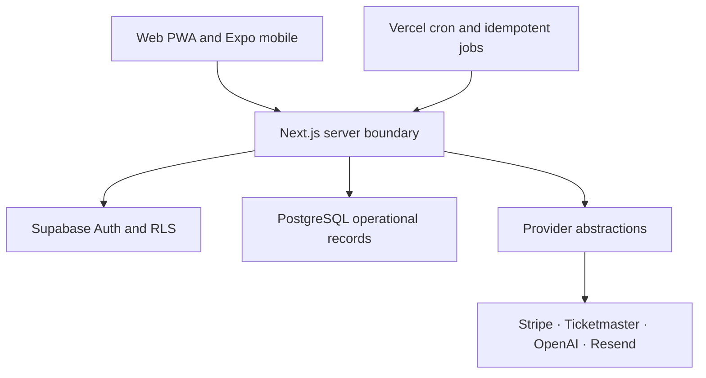
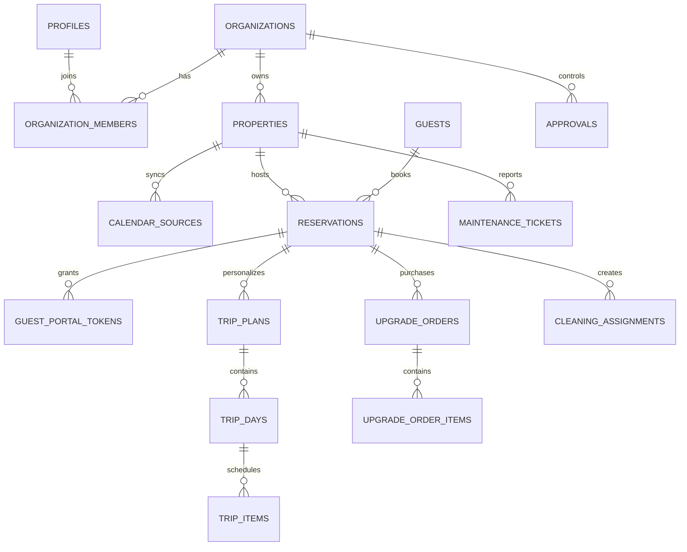

# Architecture

## Boundaries

The browser and mobile app use only public Supabase URL/anonymous-key credentials. Authorization remains database-enforced. Server routes validate inputs, derive organization access from authenticated membership, and use the service role only for narrowly scoped guest-token, webhook, public-planner, and job operations.

## Core truth paths

- Calendar: an HTTPS iCal URL is checked against local/private addresses, encrypted before storage, downloaded with redirects disabled and a timeout, parsed, deduplicated by UID, and upserted behind a unique database index. Missing source records become `orphaned`; they are not silently deleted.
- Guest portal: a 256-bit opaque token is shown once. Only its SHA-256 hash is stored. It expires, can be revoked, and exposes a narrowed reservation/property view.
- Planner: Ticketmaster facts are retrieved first. ALMA receives only normalized facts and a versioned instruction to preserve provider identities. The structured output is stored with its source references. Missing keys produce setup errors—never synthetic results.
- Payments: prices are loaded server-side from active upgrade records. Stripe Checkout is created with idempotency. Signed webhooks reconcile order/payment/subscription state. Vendor payout records remain `ledger_only` until Stripe Connect is approved and configured.
- Approvals: decisions execute through a security-definer function that rechecks host-owner/manager membership while locking the pending record.

## Database diagram

The full normalized table set is in `supabase/migrations/202607310001_initial_platform.sql`.

## Provider extension

Provider modules normalize their returned facts before any AI use. Add future maps, places, weather, PMS, smart-lock, or SMS implementations behind a server-only interface. Store provider ID, retrieval time, factual URL, and raw payload hash. A missing provider must remain a setup state.
